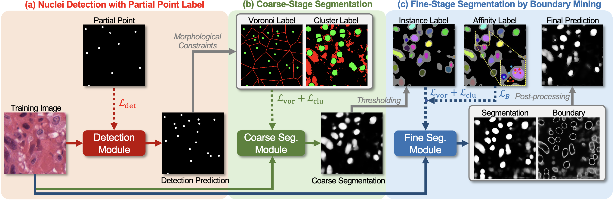
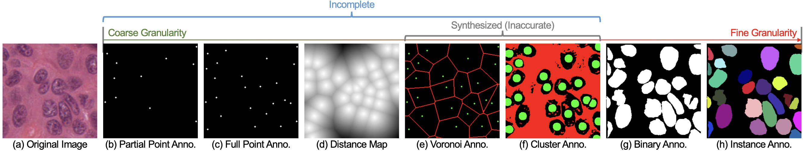

# BoNuS: Boundary Mining for Nuclei Segmentation with Partial Point Labels
This is the official code for our IPMI 2023 paper:

> [BoNuS: Boundary Mining for Nuclei Segmentation with Partial Point Labels](https://mc.manuscriptcentral.com/tmi-ieee) <br>
> Yi Lin*, Zeyu Wang*, Dong Zhang, Kwang-Ting Cheng, and Hao Chen<br>

## Highlights
<!-- <p align="justify"> -->
- A boundary mining framework for nuclei segmentation, named BoNuS, which simultaneously learns nuclei interior and boundary information from the point labels.
- A boundary mining loss that guides the model to learn the boundary information by exploring the pairwise pixel affinity in a multiple-instance learning manner.
- A nuclei detection module with curriculum learning to detect the missing nuclei with prior morphological knowledge.

<p align="center">

</p>
<p align="center">

</p>

## Usage
### Requirement
```
conda env create --name bonus --file environment.yml
```

### Data preparation
* [CPM17](https://drive.google.com/drive/folders/1l55cv3DuY-f7-JotDN7N5nbNnjbLWchK)
* [MoNuSeg](https://monuseg.grand-challenge.org)
* [CoNIC](https://conic-challenge.grand-challenge.org)


### Training & Evaluation
```
bash detection.sh
bash segmentation.sh
```

## Citation
Please cite the paper if you use the code.
```bibtex
TO BE ADDED
```